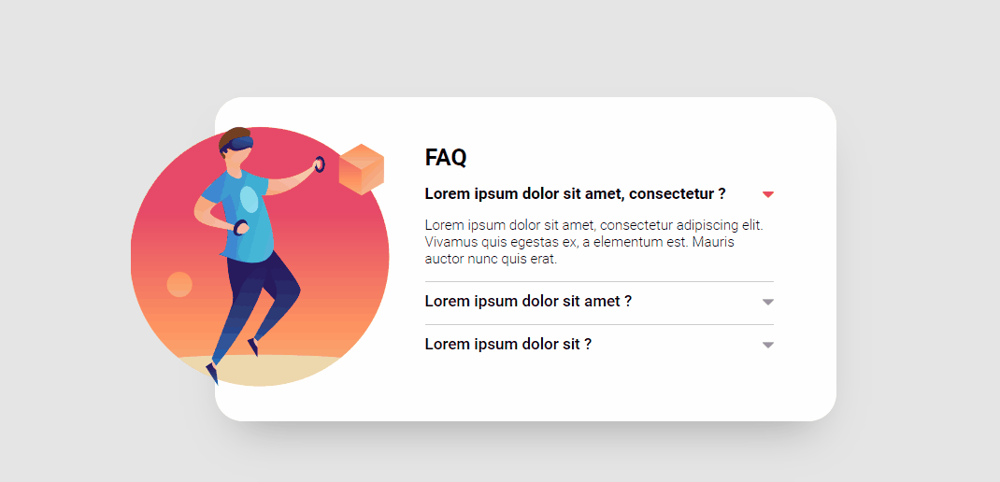

# FAQ Acordeon

Este projeto é uma implementação de um componente de FAQ em formato de acordeão, desenvolvido para praticar habilidades em HTML, CSS e JavaScript. O acordeão permite expandir e colapsar respostas às perguntas, proporcionando uma interface de usuário interativa e organizada.



## Tecnologias Utilizadas

- **HTML**
- **CSS**
- **JavaScript**

## Estrutura de Pastas

```
📦 faq-acordeon
 ┣ 📂 src
 ┃ ┣ 📂 css
 ┃ ┃ ┣ 📜 reset.css
 ┃ ┃ ┗ 📜 style.css
 ┃ ┣ 📂 img
 ┃ ┃ ┣ 🖼️ imagem-referencia.png
 ┃ ┃ ┣ 🖼️ seta-aberta.png
 ┃ ┃ ┗ 🖼️ seta-fechada.png
 ┃ ┣ 📂 js
 ┃ ┃ ┗ 📜 index.js
 ┣ 📜 index.html
 ┗ 📜 README.md
```

## Como Usar

1. Clone o repositório:

   ```bash
   git clone https://github.com/Alberesbass/faq-acordeon.git
   ```

2. Abra o arquivo `index.html` no seu navegador para visualizar o FAQ Acordeon em funcionamento.

## Licença

Este projeto está sob a licença MIT. Consulte o arquivo [LICENSE](./LICENSE) para mais informações.

---

Desenvolvido por [Alberes](https://github.com/Alberesbass)